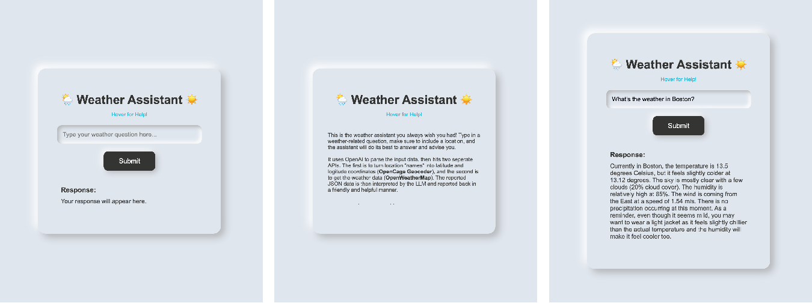

# Motivation

I've often gotten frustrated with Siri's responses to weather questions. I wanted to build a simple weather assistant that can answer questions about the weather in an agile fashion that doesn't feel overly hardcoded.

# Description

Call function from LLM. This app is a weather assistant that can answer questions about the weather. It hits three different APIs, using the OpenAI API to negotiate between the different forms of data necessary to answer the user's question, receive JSON data, and return a response in natural language. The first step is to parse the user's question to determine which API calls are necessary. If a location is specified rather than a lat/long, the OpenCage API is used to convert the location to a lat/long. Then, the OpenWeatherMap API is used to get the current weather at the specified location. Since that output is in JSON, the OpenAI API is used to parse the data and return a response in natural language. It is instructed to not add any additional information beyond what is requested, and to end with a closing remark (e.g. what the person should wear).

# Examples

  
   
  a. Landing screen   b. Hover information tooltip   c. Response to question about weather in Boston

# Running the app

To run this app, please first run `npm install express body-parser dotenv axios openai` in the root directory. I have included the .env file in the root directory, which contains the API keys for the OpenAI API, the the OpenWeatherMap API, and the OpenCage API, all of which are necessary to run the app. I understand this is not the best practice, but it will make running the app easier for you. 

To run the app, please run `node src/server.js` in the root directory.
